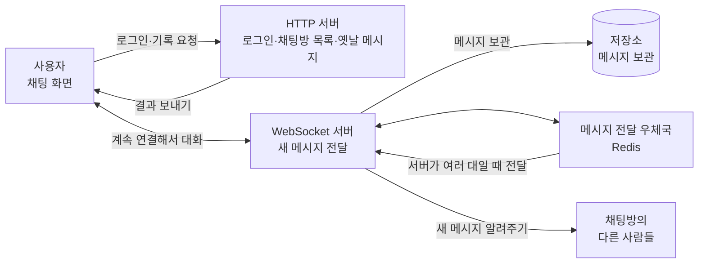

# WebSocket 쉽게 이해하기

## 1. WebSocket이란?

WebSocket은 컴퓨터와 서버가 **계속 연결된 상태로 이야기를 나누는 방법**이다.

친구와 전화를 하는 상황을 생각해 보자.

- 전화를 걸고 연결되면 계속 통화할 수 있다.
- 내가 먼저 말할 수도 있고, 친구가 먼저 말할 수도 있다.
- 새로운 말이 생기면 바로 들을 수 있다.

WebSocket도 전화와 비슷하다. 한 번 연결하면 서버와 계속 연결되어 있기 때문에, 채팅 메시지가 오자마자 화면에 보여줄 수 있다.

WebSocket 연결 주소는 보통 다음처럼 쓴다.

- `ws://`: 일반 WebSocket 연결
- `wss://`: 안전하게 암호화된 WebSocket 연결

## 2. HTTP와 WebSocket은 어떻게 다를까?

HTTP는 **편지를 보내고 답장을 기다리는 것**과 비슷하다. 내가 먼저 물어봐야 서버가 대답한다.

WebSocket은 **전화를 하는 것**과 비슷하다. 연결된 동안에는 나와 서버가 언제든지 먼저 말할 수 있다.

| 비교할 내용 | HTTP | WebSocket |
|---|---|---|
| 쉬운 비유 | 편지를 보내고 답장 받기 | 전화 통화하기 |
| 대화 방법 | 보통 내가 먼저 물어봄 | 나와 서버 모두 먼저 말할 수 있음 |
| 연결 | 필요한 일을 할 때마다 요청함 | 한 번 연결한 뒤 계속 연결함 |
| 새 메시지 받기 | 계속 물어봐야 함 | 서버가 새 메시지를 바로 알려줌 |
| 잘 어울리는 일 | 로그인, 게시글 보기, 파일 받기 | 채팅, 실시간 알림, 온라인 게임 |
| 주소 | `http://`, `https://` | `ws://`, `wss://` |

WebSocket이 HTTP보다 항상 좋은 것은 아니다. 로그인이나 예전 채팅 기록 보기처럼 한 번 물어보고 답을 받으면 되는 일은 HTTP가 편하다. 새 채팅처럼 바로 알려줘야 하는 일은 WebSocket이 편하다.

## 3. 실시간 채팅 서비스의 전체 모습

### 그림을 쉽게 설명하면

- **사용자**: 채팅을 하는 사람과 채팅 화면이다.
- **HTTP 서버**: 로그인, 채팅방 목록, 옛날 메시지를 보여준다.
- **WebSocket 서버**: 새 메시지가 오면 바로 채팅방 사람들에게 알려준다.
- **저장소**: 메시지를 잊어버리지 않도록 보관한다.
- **Redis**: WebSocket 서버가 여러 대일 때 서버끼리 소식을 전달하는 우체국 같은 역할을 한다.

## 4. 메시지가 움직이는 순서

1. 사용자가 로그인한다.
2. HTTP 서버가 채팅방 목록과 옛날 메시지를 보여준다.
3. 채팅 화면이 WebSocket 서버와 연결된다.
4. 사용자가 “안녕하세요!”라고 입력하고 보낸다.
5. WebSocket 서버가 메시지를 저장소에 보관한다.
6. WebSocket 서버가 같은 채팅방에 있는 사람들에게 메시지를 바로 보여준다.
7. 다른 사람들의 화면에도 “안녕하세요!”가 나타난다.

## 5. 우리 프로젝트에 적용하려면

현재 프로젝트는 입력한 메시지를 **내 브라우저 안에서만** 보여준다. 여러 사람이 함께 채팅하려면 다음 기능이 더 필요하다.

- WebSocket 서버 만들기
- 채팅 화면을 WebSocket 서버에 연결하기
- 보낸 메시지를 서버로 보내기
- 서버가 받은 메시지를 다른 사람들에게 보내기
- 메시지를 저장해서 나중에도 볼 수 있게 하기
- 연결이 끊겼을 때 다시 연결하기

처음에는 WebSocket 서버 한 대로 간단하게 만들 수 있다. 나중에 사용자가 많아져 서버를 여러 대 사용하게 되면 Redis 같은 메시지 전달 도구를 추가하면 된다.

## 6. 한 문장으로 정리

**HTTP는 편지처럼 필요할 때 물어보는 방법이고, WebSocket은 전화처럼 계속 연결해서 바로바로 이야기하는 방법이다.**
